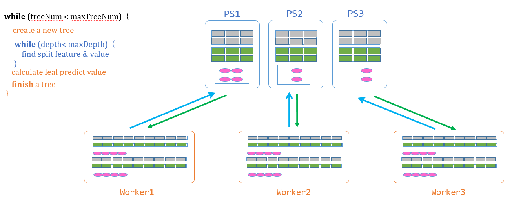

# GBDT on Angel

> **GBDT(Gradient Boosting Decision Tree)：梯度提升决策树** 是一种集成使用多个弱分类器（决策树）来提升分类效果的机器学习算法，在很多分类和回归的场景中，都有不错的效果。

## 1. 算法介绍

如图1所示，这是是对一群消费者的消费力进行预测的例子。简单来说，处理流程为：

1. 在第一棵树中，根节点选取的特征是年龄，年龄小于30的被分为左子节点，年龄大于30的被分为右叶子节点，右叶子节点的预测值为1；
2. 第一棵树的左一节点继续分裂，分裂特征是月薪，小于10K划分为左叶子节点，预测值为5；工资大于10k的划分右叶子节点，预测值为10
2. 建立完第一棵树之后，C、D和E的预测值被更新为1，A为5，B为10
3. 根据新的预测值，开始建立第二棵树，第二棵树的根节点的性别，女性预测值为0.5，男性预测值为1.5
4. 建立完第二棵树之后，将第二棵树的预测值加到每个消费者已有的预测值上，比如A的预测值为两棵树的预测值之和：5+0.5=5.5
5. 通过这种方式，不断地优化预测准确率。

## 2. 分布式实现 on Angel

---
### 1. 参数存储

如图2所示，为了优化算法性能，在参数服务器上，需要存储如下几个参数矩阵，包括：

* 每个树节点的分裂特征ID（feature ID）
* 每个树节点的分裂特征值（feature Value）
* 叶子节点的预测值（leaf-prediction）
* 全局一阶梯度直方图（grad histogram）
* 全局二阶剃度直方图（hess histogram）

所有这些参数矩阵，在整个GBDT的计算过程中，都会被反复更新和传递。

### 2. 整体流程

GBDT的流程包括几大步骤

1. **计算候选分裂点：** 扫描训练数据，对每种特征计算候选分裂特征值，从而得到候选分裂点（分裂特征+分裂特征值），常用的方法有Quantile sketch。
2. **创建决策树：** Worker创建新的树，进行一些初始化的工作，包括初始化树结构、计算训练数据的一阶和二阶梯度、初始化一个待处理树节点的队列、将树的根节点加入队列。
3. **寻找最佳分裂点 & 分裂树节点：**（下文单独讲）
4. **计算合并叶子节点的预测值：** Worker计算出叶子节点的预测值，推送给PS。
5. **完成一颗决策树，重新开始第二步。**

反复调用这几个步骤，直到完成所有树的建立，如果训练完所有决策树，计算并输出性能指标（准确率、误差等），输出训练模型。

其中，第3个步骤，寻找最佳的分裂点和分裂树节点，是最难和最重要的环节，所以我们单独讲。

### 3. 最佳分裂点 & 分裂

如何寻找最佳分裂点，并进行分裂，是GBDT的精髓和难点，而且也是参数服务器对它的重要意义所在。整体流程为：

1. **计算梯度直方图：** 从待处理树节点的队列中取出待处理的树节点，在Worker上，根据本节点的训练数据计算局部梯度直方图（包括一阶和二阶）。

2. **同步&合并直方图：** Worker通过PS接口，将局部梯度直方图推送到参数服务器。在发送之前，每个局部梯度直方图被切分为P个分块（P为参数服务器节点的个数），每个分块分别被发送到对应的参数服务器节点。PS节点在接收到Worker发送的局部梯度直方图后，确定处理的树节点，将其加到对应的全局梯度直方图上

3. **寻找最佳分裂点：** Worker使用参数服务器提供的的计算最佳分裂点的接口，从参数服务器获取每个参数服务器节点上的最佳分裂点，然后比较P个分裂点的目标函数增益，选取增益最大的分裂点作为全局最佳分裂点。

4. **分裂树节点：**  Worker根据计算得到的最佳分裂点，创建叶子节点，将本节点的训练数据切分到两个叶子节点上。如果树的高度没有达到最大限制，则将两个叶子节点加入到待处理树节点的队列。

从上面的算法逻辑剖析可以看出，GBDT这个算法，存在这大量的模型更新和同步操作，非常适合参数服务器的系统架构。具体来说，包括：

1. **超大模型：** GBDT用到的梯度直方图的大小与特征数量成正比，对于高维大数据集，梯度直方图会非常大，Angel将梯度直方图切分到到多个PS节点上存储，有效解决了高维度模型在汇总参数时的单点瓶颈问题。

2. **两阶段树分裂算法：** 在寻找最佳分裂点时，在多个PS节点上并行处理，只需要将局部最佳分裂点返回给Worker，通信开销几乎可以忽略不计。

整体来看，Angel的PS优势，使得它在这个算法上，性能远远超越了Spark版本的GBDT实现，也显著优于MPI版本的xgBoost。

## 4. 运行 & 性能

###  输入格式
* ml.feature.num：特征向量的维度   
* ml.data.type：支持"dummy"、"libsvm"两种数据格式，具体参考:[Angel数据格式](data_format.md)

### 参数

* **算法参数**
	* ml.gbdt.task.type：任务类型，classification或者regression
	* ml.gbdt.tree.num：树的数量
	* ml.gbdt.tree.depth：树的最大高度
	* ml.gbdt.split.num：每个特征的梯度直方图的大小
	* ml.learn.rate：学习速率
	* ml.validate.ratio：每次validation的样本比率，设为0时不做validation
	* ml.gbdt.sample.ratio：特征下采样的比率，默认为1
	* ml.gbdt.server.split：两阶段分裂算法开关，默认为true
	* ml.compress.bytes：低精度压缩，每个浮点数的大小，可设为[1,8]

* **输入输出参数**
	* angel.train.data.path：训练数据的输入路径
	* angel.predict.data.path：预测数据的输入路径
	* ml.feature.num：数据的特征个数
	* ml.feature.nnz：数据的非零特征个数
	* ml.gbdt.cate.feat：离散特征，"特征id:特征数量"的格式，以逗号分隔，例如"0:2,1:3"。设为"none"表示没有离散特征，设为"all"表示全部为离散特征。
	* ml.data.type：数据格式，支持"dummy"、"libsvm"
	* angel.save.model.path：训练完成后，模型的保存路径
	* angel.predict.out.path：预测结果的保存路径
	* angel.log.path：日志文件的保存路径

* **资源参数**
	* angel.workergroup.number：Worker个数
	* angel.worker.memory.mb：Worker申请内存大小
	* angel.worker.task.number：每个Worker上的task的个数，默认为1
	* angel.ps.number：PS个数
	* angel.ps.memory.mb：PS申请内存大小

* 训练任务启动命令示例

angel-submit \
    -Dangel.am.log.level=INFO \
    -Dangel.ps.log.level=INFO \
    -Dangel.worker.log.level=INFO \
    -Dangel.app.submit.class=com.tencent.angel.ml.GBDT.GBDTRunner  \
    -Daction.type=train \
    -Dml.data.type=libsvm \
    -Dml.validate.ratio=0.1 \
    -Dml.feature.num=10000 \
	  -Dml.feature.nnz=100 \
	  -Dml.gbdt.cate.feat=none \
	  -Dml.gbdt.tree.num=20 \
	  -Dml.gbdt.tree.depth=7 \
	  -Dml.gbdt.split.num=10 \
	  -Dml.gbdt.sample.ratio=1.0 \
    -Dml.learn.rate=0.01 \
    -Dml.gbdt.server.split=true \
    -Dml.compress.bytes=2 \
    -Dangel.train.data.path=$input_path \
    -Dangel.save.model.path=$model_path \
    -Dangel.workergroup.number=50 \
    -Dangel.worker.memory.mb=1000 \
    -Dangel.task.data.storage.level=memory \
    -Dangel.worker.task.number=1 \
    -Dangel.ps.number=50 \
    -Dangel.ps.memory.mb=1000

* 预测任务启动命令示例

angel-submit \
    -Dangel.am.log.level=INFO \
    -Dangel.ps.log.level=INFO \
    -Dangel.worker.log.level=INFO \
    -Dangel.app.submit.class=com.tencent.angel.ml.GBDT.GBDTRunner  \
    -Daction.type=predict \
    -Dml.data.type=libsvm \
    -Dml.validate.ratio=0.1 \
    -Dml.feature.num=10000 \
	  -Dml.feature.nnz=100 \
	  -Dml.gbdt.tree.num=20 \
	  -Dml.gbdt.tree.depth=7 \
	  -Dml.gbdt.sample.ratio=1.0 \
    -Dml.learn.rate=0.01 \
    -Dangel.predict.data.path=$input_path \
    -Dangel.save.model.path=$model_path \
    -Dangel.predict.out.path=$predict_path \
    -Dangel.workergroup.number=50 \
    -Dangel.worker.memory.mb=1000 \
    -Dangel.task.data.storage.level=memory \
    -Dangel.worker.task.number=1 \
    -Dangel.ps.number=50 \
    -Dangel.ps.memory.mb=1000

### 性能

评测腾讯的内部的数据集来比较Angel和XGBoost的性能。

* 训练数据

| 数据集 | 数据集大小 | 数据数量 | 特征数量 | 任务 |
|:------:|:----------:|:--------:|:--------:|:-------:|
| UserGender1  |    24GB    |   1250万  |   2570   | 二分类 |
| UserGender2  |    145GB    |   1.2亿  |   33万   | 二分类 |

实验的目的，是预测用户的性别。数据集 **UserGender1** 大小为24GB，包括1250万个训练数据，其中每个训练数据的特征纬度是2570；数据集 **UserGender2** 大小为145GB，包括1.2亿个训练数据，其中每个训练数据的特征纬度是33万。两个数据集都是高维稀疏数据集。

* **实验环境**

	实验所使用的集群是腾讯的线上Gaia集群(Yarn)，单台机器的配置是：

	* CPU: 2680 * 2
	* 内存：256 GB
	* 网络：10G * 2
	* 磁盘：4T * 12 (SATA)

* **参数配置**

	Angel和XGBoost使用如下的参数配置：

	  * 树的数量：20
	  * 树的最大高度：7
	  * 梯度直方图大小：10
	  * 学习速度：0.1（XGboost）、0.2（Angel）
	  * 工作节点数据：50
	  * 参数服务器数量：10
	  * 每个工作节点内存：2GB(UserGender1)、10GB(UserGender2)
	  
* **实验结果**

	| 系统   | 数据集      | 训练总时间 |每棵树时间| 测试集误差 |
	|:------:|:-----------:|:----------:|:--------:|:----------:|
	| XGBoost| UserGender1 | 36min 48s  |  110s    |  0.155008  |
	| Angel  | UserGender1 | 25min 22s  |   76s    |  0.154160  |
	| XGBoost| UserGender2 | 2h 25min   |  435s    |  0.232039  |
	| Angel  | UserGender2 | 58min 39s  |  175s    |  0.243316  |
