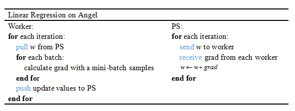

# Linear Regression

> 线性回归模型（linear regression model）利用最小二乘函数对一个或多个自变量与一个因变量之间的关系进行建模，是一种常见的预测模型。

## 1. 算法介绍

线性回归模型（linear regression model）是一种回归模型。给一个随机样本 ,i=1,\ldots,n), 一个线性回归模型假设回归子和回归量 之间的关系是除了X的影响以外，还有其他的变量存在。我们加入一个误差项（也是一个随机变量）来捕获除了 之外任何对的影响,一个多变量线性回归模型表示为以下的形式：   

 

线性回归模型使用最小二乘法计算损失，其目标是最小化残差平方和，目标函数如下所示：    

^{2})

其中：,({\displaystyle{i}=1,2,\ldots,n))为一组样本数据。

## 2. 分布式实现 on Angel

Angel MLLib提供了用Mini-Batch Gradient Descent优化方法求解的Linear Regression算法，其算法逻辑如下其中)

  

其说明如下：

* Learning Rate在迭代过程中衰减:


其中, α为衰减系数, T为迭代次数

## 3. 运行 & 性能

### 输入格式
* ml.feature.index.range：特征向量的维度, 即特征index的范围：例如如果index范围为[0, 100000000]， 则可以将该参数配置为100000000；这个参数也可以配置为-1，表示index 范围为[Integer.MIN_VALUE, Integer.MAX_VALUE] 或者[Long.MIN_VALUE, Long.MAX_VALUE]
* ml.model.size: 模型大小, 对于一些稀疏模型, 存在一些无效维度, 即所有样本要这一维度上的取值匀为0. ml.model.size = ml.feature.index.range - number of invalidate indices
* ml.data.type：支持"dense"、"libsvm"、"dummy"三种数据格式，具体参考：[Angel数据格式](data_format.md)

###  参数
* 算法参数  
	* ml.epoch.num：迭代次数   
	* ml.num.update.per.epoch: 每个epoch更新的个数  
	* ml.data.validate.ratio：每次validation的样本比率，设为0时不做validation
	* ml.learn.rate：初始学习速率   
	* ml.learn.decay：学习速率衰减系数
	* ml.reg.l1：L1惩罚项系数
	* ml.reg.l2：L2惩罚项系数
    * ml.inputlayer.optimizer：优化器类型，可选"adam","ftrl"和"momentum"
    * ml.data.label.trans.class: 是否要对标签进行转换, 默认为"NoTrans", 可选项为"ZeroOneTrans"(转为0-1), "PosNegTrans"(转为正负1), "AddOneTrans"(加1), "SubOneTrans"(减1). 
    * ml.data.label.trans.threshold: "ZeroOneTrans"(转为0-1), "PosNegTrans"(转为正负1)这两种转还要以设一个阈值, 大于阈值的为1, 阈值默认为0
    * ml.data.posneg.ratio: 正负样本重采样比例, 对于正负样本相差较大的情况有用(如5倍以上)

* 输入输出参数
    * ml.feature.index.range：特征向量的维度
    * ml.data.type: 支持"dense"、"libsvm"两种数据格式
	* angel.train.data.path：训练数据的输入路径
	* angel.predict.data.path：预测数据的输入路径
	* angel.save.model.path：训练完成后，模型的保存路径
	* angel.predict.out.path：预测结果存储路径
	* angel.log.path：log文件保存路径   

* 资源参数
   * angel.workergroup.number：Worker个数   
   * angel.worker.memory.mb：Worker申请内存大小    
   * angel.worker.task.number：每个Worker上的task的个数，默认为1    
   * angel.ps.number：PS个数    
   * angel.ps.memory.mb：PS申请内存大小   

* 提交命令

 	*向Yarn集群提交LinearRegression算法训练任务:

	```java
	./bin/angel-submit \
		--action.type=train \
		--angel.app.submit.class=com.tencent.angel.ml.core.graphsubmit.GraphRunner \
		--ml.model.class.name=com.tencent.angel.ml.regression.LinearRegression \
		--angel.train.data.path=$input_path \
		--angel.save.model.path=$model_path \
		--angel.log.path=$log_path \
		--ml.data.is.classification=false \
		--ml.model.is.classification=false \
		--ml.epoch.num=10 \
		--ml.feature.index.range=$featureNum+1 \
		--ml.data.validate.ratio=0.1 \
		--ml.learn.rate=0.1 \
		--ml.learn.decay=1 \
		--ml.reg.l2=0.001 \
		--ml.num.update.per.epoch=10 \
		--ml.worker.thread.num=4 \
		--ml.data.type=libsvm \
		--ml.model.type=T_FLOAT_DENSE \
		--angel.workergroup.number=2 \
		--angel.worker.memory.mb=5000 \
		--angel.worker.task.number=1 \
		--angel.ps.number=2 \
		--angel.ps.memory.mb=5000 \
		--angel.job.name=linearReg_network \
		--angel.output.path.deleteonexist=true
	```

	*向Yarn集群提交LinearRegression算法增量训练任务:

	```java
	./bin/angel-submit \
		--action.type=inctrain \
		--angel.app.submit.class=com.tencent.angel.ml.core.graphsubmit.GraphRunner \
		--ml.model.class.name=com.tencent.angel.ml.regression.LinearRegression \
		--angel.train.data.path=$input_path \
		--angel.load.model.path=$model_path \
		--angel.save.model.path=$model_path \
		--angel.log.path=$log_path \
		--ml.model.is.classification=false \
		--ml.data.is.classification=false \
		--ml.epoch.num=10 \
		--ml.feature.index.range=$featureNum+1 \
		--ml.data.validate.ratio=0.1 \
		--ml.learn.rate=0.1 \
		--ml.learn.decay=1 \
		--ml.reg.l2=0.001 \
		--ml.num.update.per.epoch=10 \
		--ml.worker.thread.num=4 \
		--ml.data.type=libsvm \
		--ml.model.type=T_FLOAT_DENSE \
		--angel.workergroup.number=2 \
		--angel.worker.memory.mb=5000 \
		--angel.worker.task.number=1 \
		--angel.ps.number=2 \
		--angel.ps.memory.mb=5000 \
		--angel.job.name=linearReg_network \
		--angel.output.path.deleteonexist=true
	```

	*向Yarn集群提交LinearRegression算法预测任务:

	```java
	./bin/angel-submit \
		--action.type=predict \
		--angel.app.submit.class=com.tencent.angel.ml.core.graphsubmit.GraphRunner \
		--ml.model.class.name=com.tencent.angel.ml.regression.LinearRegression \
		--angel.predict.data.path=$input_path \
		--angel.save.model.path=$model_path \
		--angel.predict.out.path $predict_path \
		--angel.log.path=$log_path \
		--ml.feature.index.range=$featureNum+1 \
		--ml.data.type=libsvm \
		--ml.model.type=T_FLOAT_DENSE \
		--ml.worker.thread.num=4 \
		--angel.workergroup.number=2 \
		--angel.worker.memory.mb=5000 \
		--angel.worker.task.number=1 \
		--angel.ps.number=2 \
		--angel.ps.memory.mb=5000 \
		--angel.job.name=linearReg_network_predict \
		--angel.output.path.deleteonexist=true
	```

### 性能
* 数据：E2006-tfidf，1.5×10^5 特征，1.6×10^4 样本
* 资源：
	* Angel：executor：2个，5G内存，1个task；ps：2个，5G内存
* 迭代100次时间：
	* Angel：25 min
	
