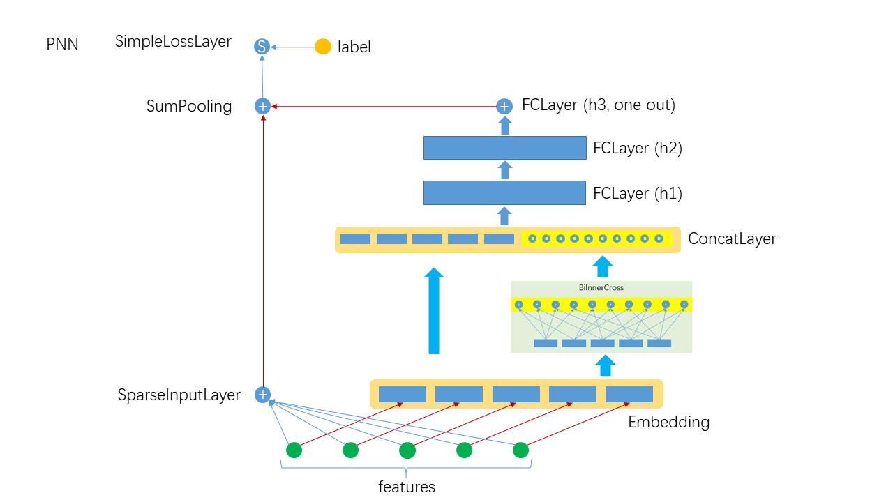

# PNN

## 1. Introduction of Algorithm
The algorithm is based on Embedding, perform a pair of inner or outer product on embedding result, and then the inner/outer product result is spliced together with the original Embedding result and is entered into the DNN to further extract the high-order crossed feature. It is worth noting that the PNN does not abandon the first-order feature, and finally first-order features are combined with higher-order features for prediction. The structure is as follows:


ps: Angel currently only implements PNN in inner product version.

### 1.1 Description of the BiInnerCross layer
In implementation, it is stored by Embedding. After calling Embedding's 'calOutput', computing and output result together. So the Embedding output of a sample is 

=(\bold{u}_1,\bold{u}_2,\bold{u}_3,\cdots,\bold{u}_k))

The inner product of each the Embedding feature pairs is:

)

The above is BiInnerCross's forward calculation method, which is implemented by Scala code:

```scala
(0 until batchSize).foreach { row =>
    val partitions = mat.getRow(row).getPartitions
    var opIdx = 0
    partitions.zipWithIndex.foreach { case (vector_outter, cidx_outter) =>
    if (cidx_outter != partitions.length - 1) {
        ((cidx_outter + 1) until partitions.length).foreach { cidx_inner =>
        data(row * outputDim + opIdx) = vector_outter.dot(partitions(cidx_inner))
        opIdx += 1
        }
    }
    }
}
```
The difference between BiInnerCross and BiInnerSumCross is that the latter sums the results of the inner products and outputs them as a scalar. The former is not added up, and the output is a vector. For BiInnerCross, the output dimension isis the number of fields, regardless of the dimension of the Embedding vector.

### 1.2 Description of other layers
- SparseInputLayer: Sparse data input layer, specially optimized for sparse high-dimensional data, essentially a FClayer
- Embedding: Implicit embedding layer, if the feature is not one-hot, multiply the feature value
- FCLayer: The most common layer in DNN, linear transformation followed by transfer function
- SumPooling: Adding multiple input data as element-wise, requiring inputs have the same shape
- SimpleLossLayer: Loss layer, you can specify different loss functions

### 1.3 Building Network
```scala
  override def buildNetwork(): Unit = {
    val wide = new SparseInputLayer("input", 1, new Identity(),
      JsonUtils.getOptimizerByLayerType(jsonAst, "SparseInputLayer"))

    val embeddingParams = JsonUtils.getLayerParamsByLayerType(jsonAst, "Embedding")
      .asInstanceOf[EmbeddingParams]
    val embedding = new Embedding("embedding", embeddingParams.outputDim, embeddingParams.numFactors,
      embeddingParams.optimizer.build()
    )

    val crossOutputDim = numFields * (numFields - 1) / 2
    val innerCross = new BiInnerCross("innerPooling", crossOutputDim, embedding)

    val concatOutputDim = embeddingParams.outputDim + crossOutputDim
    val concatLayer = new ConcatLayer("concatMatrix", concatOutputDim, Array[Layer](embedding, innerCross))

    val hiddenLayers = JsonUtils.getFCLayer(jsonAst, concatLayer)

    val join = new SumPooling("sumPooling", 1, Array[Layer](wide, hiddenLayers))

    new SimpleLossLayer("simpleLossLayer", join, lossFunc)
  }
```

## 2.  Running and performance
### 2.1 Explanation of Json configuration File
There are many parameters of PNN, which need to be specified by Json configuration file (for a complete description of Json configuration file, please refer to[Json explanation]()), A typical example is:
```json
{
  "data": {
    "format": "dummy",
    "indexrange": 148,
    "numfield": 13,
    "validateratio": 0.1
  },
  "model": {
    "modeltype": "T_FLOAT_SPARSE_LONGKEY",
    "modelsize": 148
  },
  "train": {
    "epoch": 10,
    "numupdateperepoch": 10,
    "lr": 0.01,
    "decay": 0.1
  },
  "default_optimizer": "Momentum",
  "layers": [
    {
      "name": "wide",
      "type": "sparseinputlayer",
      "outputdim": 1,
      "transfunc": "identity"
    },
    {
      "name": "embedding",
      "type": "embedding",
      "numfactors": 8,
      "outputdim": 104,
      "optimizer": {
        "type": "momentum",
        "momentum": 0.9,
        "reg2": 0.01
      }
    },
    {
      "name": "biInnerCross",
      "type": "BiInnerCross",
      "outputdim": 78,
      "inputlayer": "embedding"
    },
    {
      "name": "concatlayer",
      "type": "ConcatLayer",
      "outputdim": 182,
      "inputlayers": [
        "embedding",
        "biInnerCross"
      ]
    },
    {
      "name": "fclayer",
      "type": "FCLayer",
      "outputdims": [
        200,
        200,
        1
      ],
      "transfuncs": [
        "relu",
        "relu",
        "identity"
      ],
      "inputlayer": "concatlayer"
    },
    {
      "name": "sumPooling",
      "type": "SumPooling",
      "outputdim": 1,
      "inputlayers": [
        "wide",
        "fclayer"
      ]
    },
    {
      "name": "simplelosslayer",
      "type": "simplelosslayer",
      "lossfunc": "logloss",
      "inputlayer": "sumPooling"
    }
  ]
}

```

### 2.2 Explanation of submit scripts
```shell
runner="com.tencent.angel.ml.core.graphsubmit.GraphRunner"
modelClass="com.tencent.angel.ml.classification.ProductNeuralNetwork"

$ANGEL_HOME/bin/angel-submit \
    --angel.job.name DeepFM \
    --action.type train \
    --angel.app.submit.class $runner \
    --ml.model.class.name $modelClass \
    --angel.train.data.path $input_path \
    --angel.workergroup.number $workerNumber \
    --angel.worker.memory.gb $workerMemory  \
    --angel.ps.number $PSNumber \
    --angel.ps.memory.gb $PSMemory \  
    --angel.task.data.storage.level $storageLevel \
    --angel.task.memorystorage.max.gb $taskMemory
```

For the deep learning model, its data, training and network configuration should be specified with the Json file first.


