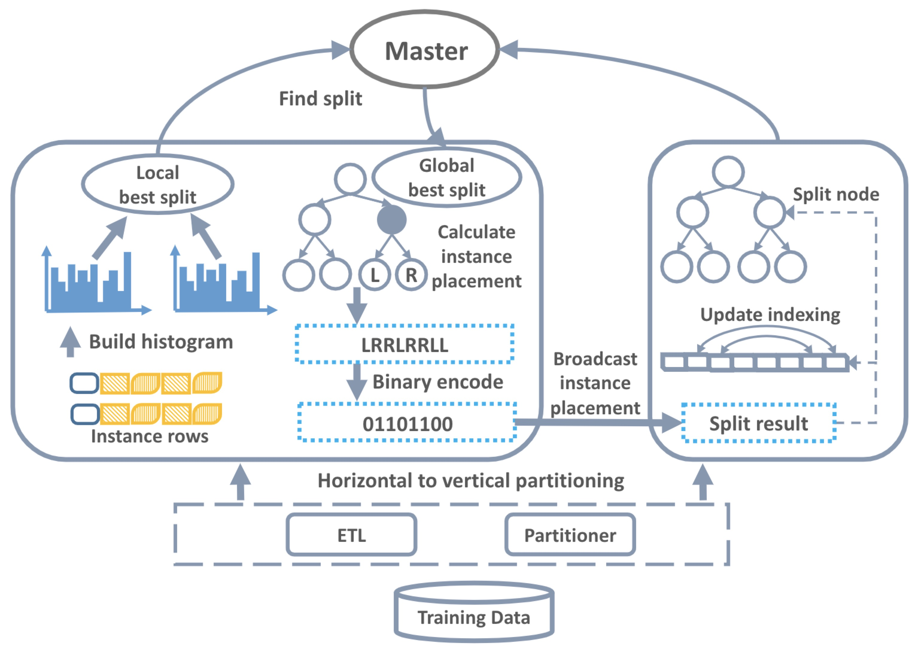

# GBDT on Spark on Angel

> **GBDT(Gradient Boosting Decision Tree)：梯度提升决策树** 是一种集成使用多个弱分类器（决策树）来提升分类效果的机器学习算法，在很多分类和回归的场景中，都有不错的效果。

## 1. 算法介绍

如图1所示，这是是对一群消费者的消费力进行预测的例子。简单来说，处理流程为：

1. 在第一棵树中，根节点选取的特征是年龄，年龄小于30的被分为左子节点，年龄大于30的被分为右叶子节点，右叶子节点的预测值为1；
2. 第一棵树的左一节点继续分裂，分裂特征是月薪，小于10K划分为左叶子节点，预测值为5；工资大于10k的划分右叶子节点，预测值为10
2. 建立完第一棵树之后，C、D和E的预测值被更新为1，A为5，B为10
3. 根据新的预测值，开始建立第二棵树，第二棵树的根节点的性别，女性预测值为0.5，男性预测值为1.5
4. 建立完第二棵树之后，将第二棵树的预测值加到每个消费者已有的预测值上，比如A的预测值为两棵树的预测值之和：5+0.5=5.5
5. 通过这种方式，不断地优化预测准确率。

## 2. 分布式训练

GBDT的训练方法中，核心是一种叫梯度直方图的数据结构，需要为每一个特征建立一阶梯度直方图和二阶梯度直方图。
梯度直方图的大小与三个因素有关：特征数量、分裂点数量、分类数量和树节点的数量。

已有的分布式GBDT系统使用数据并行的方法，将训练数据按行进行切分，每个计算节点使用分配的数据集建立梯度直方图，通过网络汇总这些梯度直方图后，计算得出最佳的分裂点。
但是当训练数据维度高、分类多、树深度大的时候，梯度直方图的大小较大，数据并行的训练方法有几个缺点：

1. 每个计算节点都需要存储一份完整的梯度直方图，存储的开销大。在存储空间有限时，限制了GBDT的适用性。
2. 计算节点之间需要通过网络传输本地的梯度直方图，网络通信的开销大。

为了解决数据并行的训练方式的缺点，Angel实现了特征并行的训练方式。

## 3. 特征并行GBDT

与数据并行的训练方式不同，Angel按列切分训练数据，我们把这种分布式训练方式叫做特征并行，训练的流程如图2所示：

1. **数据集转换：** 由于原始的数据集一般是按行存储于分布式文件系统，我们读取训练数据后做全局的数据转换，每个计算节点分配一个特征子集。
2. **建立梯度直方图：** 每个计算节点使用特征子集建立梯度直方图，得益于特征并行的方式，不同计算节点为不同特征建立梯度直方图。
3. **寻找最佳分裂点：** 基于本地梯度直方图，每个计算节点计算出本地特征子集的最佳分裂点（分裂特征+分裂特征值）；计算节点之间通过网络汇总得到全局的最佳分裂点。
4. **计算分裂结果：** 由于每个计算节点只负责一个特征子集，训练数据的分裂结果（左子节点/右子节点）只有一个计算节点能够确定，此计算节点讲训练数据的分裂结果（经过二进制编码）广播给其他计算节点。
5. **分裂树节点：** 根据训练数据的分裂结果，更新树结构，如果没有达到停止条件，跳转到第2步继续训练。

与数据并行相比，特征并行使得每个计算节点只需要存储一部分的梯度直方图，减少存储开销，使得可以增大分裂点数量和树深度来提升模型精度。
另一方面，特征并行不需要通过网络汇总梯度直方图，在高维场景下更为高效，传输分裂结果的网络开销可以通过二进制编码来降低。

## 4. 运行 & 性能

###  输入格式
* ml.feature.index.range：特征向量的维度
* ml.data.type：支持"libsvm"的数据格式，具体参考:[Angel数据格式](../data_format.md)

### 参数

* **算法参数**
  * ml.gbdt.task.type：任务类型，分类或者回归
  * ml.gbdt.loss.func：代价函数，支持二分类（binary:logistic）、多分类（multi:logistic）和均方根误差（rmse）
  * ml.gbdt.eval.metric：模型指标，支持rmse、error、log-loss、cross-entropy、precision和auc
  * ml.num.class：分类数量，仅对分类任务有用
  * ml.gbdt.feature.sample.ratio：特征采样比例（0到1之间）
  * ml.gbdt.tree.num：树的数量	
  * ml.gbdt.tree.depth：树的最大高度
  * ml.gbdt.split.num：每个特征的分裂点的数量
  * ml.learn.rate：学习速率
  * ml.gbdt.min.node.instance：叶子节点上数据的最少数量
  * ml.gbdt.min.split.gain：分裂需要的最小增益
  * ml.gbdt.reg.lambda：正则化系数

* **输入输出参数**
	* angel.train.data.path：训练数据的输入路径
	* angel.validate.data.path：验证数据的输入路径
	* angel.predict.data.path：预测数据的输入路径
	* angel.predict.out.path：预测结果的保存路径
	* angel.save.model.path：训练完成后，模型的保存路径
	* angel.load.model.path：预测开始前，模型的加载路径

### 训练任务启动命令示例

使用spark提交任务
 
  ./spark-submit \
    --master yarn-cluster \   
    --conf spark.ps.jars=$SONA_ANGEL_JARS \  
    --conf spark.ps.cores=1 \
    --conf spark.ps.memory=10g \
    --conf spark.ps.log.level=INFO \
    --queue $queue \
    --jars $SONA_SPARK_JARS  \
    --name "GBDT on Spark-on-Angel" \
    --driver-memory 5g \  
    --num-executors 10 \  
    --executor-cores 1 \  
    --executor-memory 10g \   
    --class com.tencent.angel.spark.ml.tree.gbdt.trainer.GBDTTrainer \  
    spark-on-angel-mllib-${ANGEL_VERSION}.jar \   
    ml.gbdt.task.type:classification \
    angel.train.data.path:XXX angel.validate.data.path:XXX angel.save.model.path:XXX \  
    ml.gbdt.loss.func:binary:logistic ml.gbdt.eval.metric:error,log-loss \  
    ml.learn.rate:0.1 ml.gbdt.split.num:10  ml.gbdt.tree.num:20 ml.gbdt.tree.depth:7 ml.num.class:2 \ 
    ml.feature.index.range:47237 ml.gbdt.feature.sample.ratio:1.0 ml.gbdt.multi.class.strategy:one-tree ml.gbdt.min.node.instance:100
    
### 预测任务启动命令示例

使用spark提交任务

  ./spark-submit \
      --master yarn-cluster \   
      --conf spark.ps.jars=$SONA_ANGEL_JARS \  
      --conf spark.ps.cores=1 \
      --conf spark.ps.memory=10g \
      --conf spark.ps.log.level=INFO \
      --queue $queue \
      --jars $SONA_SPARK_JARS  \
      --name "GBDT on Spark-on-Angel" \
      --driver-memory 5g \  
      --num-executors 10 \  
      --executor-cores 1 \  
      --executor-memory 10g \   
      --class com.tencent.angel.spark.ml.tree.gbdt.predictor.GBDTPredictor \  
      spark-on-angel-mllib-${ANGEL_VERSION}.jar \
      angel.load.model.path:XXX angel.predict.data.path:XXX angel.predict.out.path:XXX  \  
      
  

## 5. 性能

评测腾讯的内部的数据集来比较Angel和XGBoost的性能。

* 训练数据

  | 数据集 | 数据集大小 | 数据数量 | 特征数量 | 任务 |
  |:------:|:----------:|:--------:|:--------:|:-------:|
  | UserGender  |    145GB    |   1.2亿  |   33万   | 二分类 |

* **实验环境**

	实验所使用的集群是腾讯的线上Gaia集群(Yarn)，单台机器的配置是：
    *
	  * CPU: 2680 * 2
	  * 内存：256 GB
	  * 网络：10G * 2
	  * 磁盘：4T * 12 (SATA)

* **参数配置**

	Angel和XGBoost使用如下的参数配置：

	  * 树的数量：20
	  * 树的最大高度：8
	  * 梯度直方图大小：10
	  * 学习速度：0.1（XGboost）、0.1（Angel）
	  * 工作节点数据：50
	  * 每个工作节点内存：20GB
	  
* **实验结果**

	| 系统   | 数据集      | 每棵树时间| 测试集误差 |
	|:------:|:-----------:|:--------:|:----------:|
	| XGBoost| UserGender |   438s    |  0.15  |
	| Angel  | UserGender |  79s    |  0.15  |
