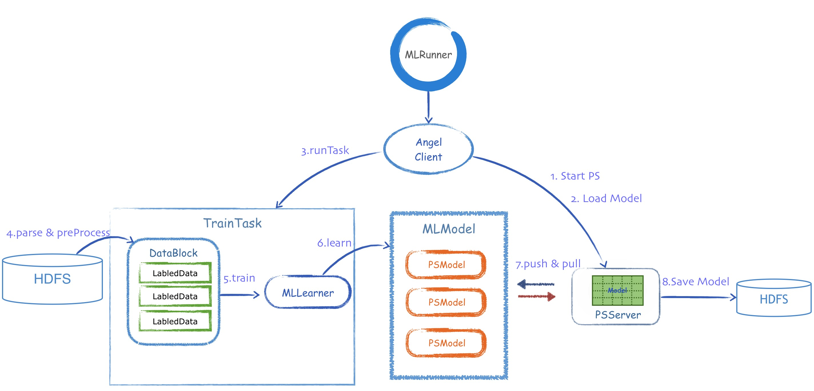

# 核心接口类

---

如上图所示，Angel的核心接口类，在Train的过程中，按照调用的流程，大体为：

1. [MLRunner](MLRunner.md)
	* MLRunner根据Conf，从工厂类，创建AngelClient，按照标准的Train流程开始依次调用AngelClient的各接口

* [AngelClient](AngelClient.md)
	* 启动PSServer
	* 在PSServer上进行初始化，加载空白的模型
	* 训练完成后，将模型从多个PSServer，保存到HDFS

* [TrainTask](Task.md)
	* 在被AngelClient调用后，开始Train过程

* [DataBlock](DataBlock.md)
	* TrainTask调用parse和preProcess方法，将数据从HDFS中读取，并组装成为多个LabeledData组成的DataBlock
	* TrainTask调用Train方法，创建MLLearner对象，并将DataBlock传给MLLearner
	
* [MLLearner](MLLearner.md)
	* MLLearner调用自己的Learn方法，读取DataBlock，计算出模型的更新，并通过MLModel中的PSModel，和PSServer进行不停的Push和Pull，最终得到一个完整的MLModel

* [MLModel](MLModel.md)
	* 根据算法的需要，创建并容纳多个PSModel

* [PSModel](PSModel.md)
	* 封装了AngelClient中和PSServer的所有通信接口，方便MLLearner调用

了解这些核心类和流程，对基于Angel实现高性能的机器学习算法，将会有不错的帮助。
