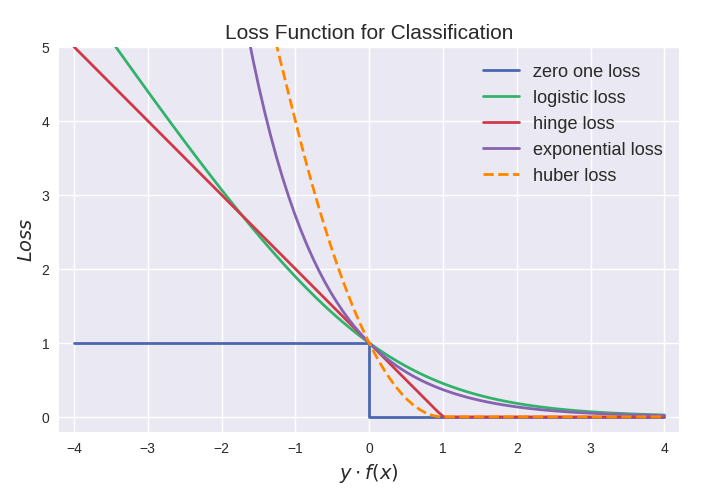

# Angel中的损失函数

## 1. Angel中的损失函数
Angel中有丰富的损失函数, 可分为两类
- 分类损失函数
- 回归损失函数

分类损失函数如下表所示:

名称|表达式|描述
---|---|---
CrossEntoryLoss| }) | 用于分类, 逻辑回归是一种特例, 也可以用于多分类Softmax, 它要求输入是概率), 而不是)
LogLoss| }\)}) | 用于分类, 是逻辑回归的损失函数, 可以看成是CrossEntoryLoss函数的一种特列, 用Sigmoid的方式具体化了)
SoftmaxLoss| \log\frac{x^{x_i}}{\sum_je^{x_j}}) | 它是CrossEntoryLoss的特殊形式, 用Softmax的方式具体化了)
HingeLoss| \)}) | SVM的损失函数

用图形化表示如下:



回归损失函数如下表所示:
名称|表达式|描述
---|---|---
L2Loss | \|_2^2) | 用于回归, 是最小二乘回归的损失函数
HuberLoss | -\frac{\delta}{2}\),&abs(x)>\delta\\\\\frac{1}{2}x^2,&abs(x)\le\delta\end{array}\right.) | 用于回归, 它在0附近用二次函数, 在其它地方用一次函数, 解决了绝对值函数在0附近不可导的问题, 用Huber损失得到的模型较为橹棒

用图形化表示如下:


## 2. Angel中Loss的实现
Angel中的损失函数都实现了LossFunc Trait, 如下:
```scala
trait LossFunc extends Serializable {
  def calLoss(modelOut: Matrix, graph: AngelGraph): Double

  def loss(pred: Double, label: Double): Double

  def calGrad(modelOut: Matrix, graph: AngelGraph): Matrix

  def predict(modelOut: Matrix): Matrix
}
```
可见, angel中的loss的不仅有计算loss的功能, 还有`计算梯度`, `预测`两项功能. 正是由于在Loss中实现了梯度计算, 才使反向传导有了起点. 在LossLayer中计算梯度就是直接调用lossFunc的calGrad, 如下:
```scala
  override def calGradOutput(): Matrix = {
    val start = System.currentTimeMillis()
    status match {
        gradOutput = lossFunc.calGrad(output, graph)
        status = STATUS.Backward
      case _ =>
    }
    val end = System.currentTimeMillis()
    gradOutput
  }
```
另外一项功能是`预测`, 在LossLayer中计算预测值就是直接调用lossFunc的predict, 如下:
```scala
  override def predict(): Matrix = {
    status match {
      case STATUS.Null =>
        calOutput()
      case _ =>
    }

    lossFunc.predict(output)
  }
```

## 3. Loss Function的Json
### 3.1 无参数的损失函数
除了huberloss外, 其它的lossfunc匀为无参数的损失函数, 有两种表达方式, 如下
```json
"lossfunc": "logloss"

"lossfunc": {
    "type": "logloss"
} 
```

### 3.2 参数的损失函数
只有huberloss, 具体如下:
```json
"lossfunc": {
    "type": "huberloss",
    "delta": 0.1
}
```
