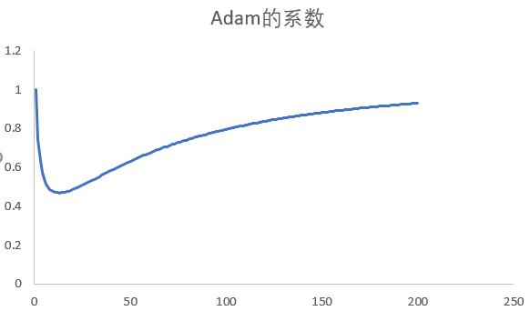

# Angel中的优化器

机器学习的优化方法多种多样, 但在大数据场景下, 使用最多的还是基于SGD的一系列方法. 在Angel中目前只实现了少量的最优化方法, 如下:
- 基于随机梯度下降的方法
    - SDG: 这里指mini-batch SGD (小批量随机梯度下降)
    - Momentum: 带动量的SGD
    - Adam: 带动量与对角Hessian近似的SGD
- 在线学习方法
    - FTRL: Follow The Regularized Leader, 一种在线学习方法

## 1. SGD
SGD的更新公式如下:


其中, $\eta$是学习率. 使用SGD可以带正则, 实际优化采用的是PGD(proximal gradient descent). 

json方式表达有两种, 如下:
```json
"optimizer": "sgd",

"optimizer": {
    "type": "sgd",
    "reg1": 0.01,
    "reg2": 0.02
}
```

## 2. Momentum
Momentum的更新公式如下:


其中, 是动量因子, 是学习率. 另外, Momentum也是可以带正则的. Angel中默认的最优化方法为Momentum.

json方式表达有两种, 如下:
```json
"optimizer": "sgd",

"optimizer": {
    "type": "momentum",
    "momentum": 0.9,
    "reg2": 0.01
}
```

## 3. Adam
Adam是一种效果较好的最优化方法, 更新公式为:

\Delta\bold{x}_t\\\\\\bold{v}_t&=\gamma\bold{v}_{t-1}+(1-\gamma)\Delta\bold{x}^2_t\\\\\bold{x}_t&=\gamma\bold{x}_{t-1}-\eta\frac{\sqrt{1-\gamma^t}}{1-\beta^t}\frac{\bold{m}_t}{\sqrt{\bold{v}_t}+\epsilon}\\%20\end{array})

其中, 是梯度的指数平滑, 即动量,  是梯度的指数平滑, 可以看作Hessian的对角近似. 默认情况下, 记

=\frac{\sqrt{1-\gamma^t}}{1-\beta^t})

则)是一个初值为1, 极限为1的函数, 中间过程先减后增, 如下图所示:


即在优化的初始阶段, 梯度较大, 适当地减小学习率, 让梯度下降缓和平滑; 在优化的最后阶段, 梯度很小, 适当地增加学习率有助于跳出局部最优.

json方式表达有两种, 如下:
```json
"optimizer": "adam",

"optimizer": {
    "type": "adam",
    "beta": 0.9,
    "gamma": 0.99,
    "reg2": 0.01
}
```

## 4. FTRL
FTRL是一种在线学习算法, 它的目标是优化regret bound, 在一定的学习率衰减条件下, 可以证明它是有效的.

FTRL的另一个特点是可以得到非常稀疏的解, 表现上比PGD(proximal gradient descent)好, 也优于其它在线学习算法, 如FOBOS, RDA等.

FTRL的算法流程如下:


json方式表达有两种, 如下:
```json
"optimizer": "ftrl",

"optimizer": {
    "type": "ftrl",
    "alpha": 0.1,
    "beta": 1.0,
    "reg1": 0.01,
    "reg2": 0.01
}
```
注: 是正则化常数, 对应json中的"reg1, reg2"
