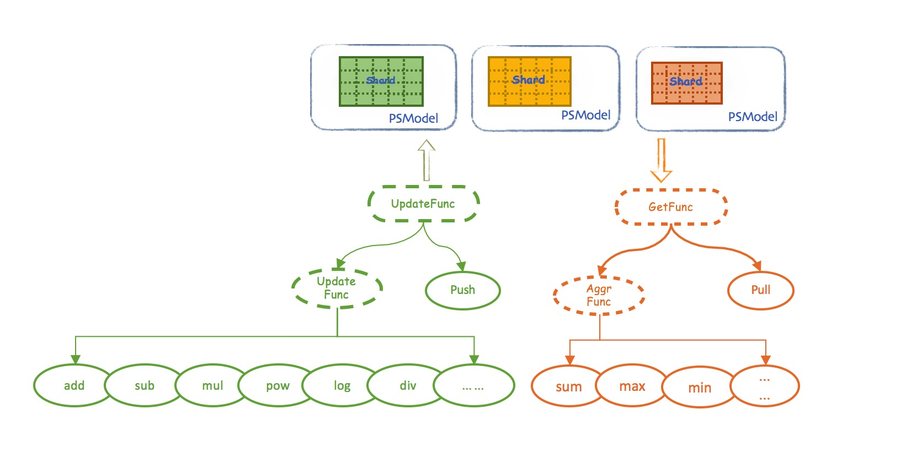

# Angel PSF开发手册

作为标准的参数服务器系统，一般会提供基本的参数**获取（pull）和更新（push）**功能。

但实际应用中，各个算法对参数服务器上的参数获取和更新，却远远不只这么简单，尤其是当算法需要实施一些特定的优化的时候。

> 举个例子，有时候要得到`矩阵中某一行的最大值`，如果只有基本的参数获取的Pull接口，那么Client只能先将该行的**所有列**，都从参数服务器上拉取回来，然后在Worker上计算得到最大值，这样会产生很多的网络通信开销，对性能会有影响。

为了解决类似的问题，Angel对参数获取和更新的流程进行了抽象，添加了`psFunc`的概念。之所以不叫UDF，是因为它不仅仅是一个UDF的功能，充分的利用psFunc，对改进算法的可读性和功能，都有很大的帮助。

psFunc的整体架构图如下：

* [psFunc简介](psf_describe.md)
* [get](psf_get.md)
* [update](psf_update.md)
* [psf库](psf_lib.md)
